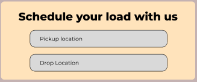
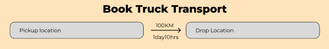

# Load Booking Flow Document
	- ## **Landing Page**
		- The user first enters the trip's origin and destination using an intelligent, autocomplete-enabled input field. This section details the front-end interaction and the API integration that powers it.
		- ### Pickup and Drop Location
		  collapsed:: true
			- 
			- **Input Field**
				- Two separate input fields are used: one for **pickup location** and one for **drop-off location**.
				- **Autocomplete is enabled** using the **Google Maps Places API**, which provides a rich set of location data. This significantly improves data accuracy and user experience.
				- The system extracts and stores key location components: **State**, **City**, **Area**, and **PIN code**.
				- Example: `Jubilee Hills, Hyderabad, Telangana, PIN 500033`
			- **JavaScript**
				- ***File:*** `./app/static/js/googleControls.js` [[HelperFunctions]]
				- ```javascript
				  //Helper function which Returns all input elements whose ID contains "location" or "address".
				  const locationsInputs = getAllLocationInputs();  
				  function locationInput(inputs){
				    inputs.forEach((input) => {
				      const autocomplete = new AutoComplete(input, {
				        // Initialize Google Maps Autocomplete
				  	});
				      autocomplete.addListener('place_change', () => {
				        const places = autocomplete.getPlaces();
				  	  // Helper function Autofills an input with the corresponding address component
				        // (state, city, area, postal code) based on its ID.
				        fillInAdress(input, places);
				      });
				    });
				  }
				  ```
			- **HTML**
				- ***File:*** `./app/template/landing.html`
				- ```html
				  {{ form.pickup_loaction(class = "form-control location-input") }}
				  {{ form.drop_location(class = "form-control location-input") }}
				  ```
		- ### Distance Between Pickup & Drop
		  collapsed:: true
			- 
			- **Input Field**
				- This is not a manual input field. It's a display element that is updated dynamically once both pickup and drop locations are entered and validated.
				- It shows the **approximate distance** in kilometers (`km`) and **approximate time** in day/hr(`day`/`hr`).
				- A clear label or button prompts the user to **"Confirm Distance"** to acknowledge the calculated value.
			- **JavaScript**
				- ***File***: `./app/static/js/googleControls.js`
				- ```javascript
				  function calculateDistance(pickup, drop) {
				    // Google Maps DistanceMatrixService
				    const service = new google.maps.DistanceMatrixService();
				    const request = {
				    	origins: [pickup],
				    	destinations: [drop],
				    	travelMode: google.maps.TravelMode.DRIVING,
				      unitSystem: google.maps.UnitSystem.METRIC,
				    };
				    service.getDistanceMatrix(request, (responce, status) => {
				      if (status === 'OK'){
				        const results = responce.rows[0].elements[0];
				        if (results.status == 'OK'){
				          const distance = results.distance.text;
				          const duration = results.duration.text;
				  		return distance, duration
				        }else {
				          console.error("Error with distance calculation:", results.status);
				          // Inform user that distance could not be calculated.
				        }
				      } else {
				        console.error("Distance Matrix Service failed:", status);
				      }
				    });
				  };
				  //Helper function unhide the div showing the distance and duration
				  const distance, duration = calculateDistance(pickup, drop)
				  displayDistanceDuration(distance, duration);
				  ```
			- **HTML**
			  collapsed:: true
				- ***File:*** `./app/template/landing.html`
				- ```html
				    <div class="container d-flex justify-content-center align-items-center py-5">
				      <!-- Pickup -->
				      <div class="route-box">Pickup Location</div>
				  
				      <!-- Arrow with text -->
				      <div class="arrow d-flex flex-column align-items-center justify-content-center">
				        <div class="arrow-text">100 KM</div>
				        <div class="arrow-text">1 day 10 hrs</div>
				      </div>
				  
				      <!-- Drop -->
				      <div class="route-box">Drop Location</div>
				    </div>
				  ```
				-
		- ### Trip Date Time
		  collapsed:: true
			- **Input Field**
				- A single **datetime-local** input field is used to select both date and time.
				- Past dates and times are **restricted** to prevent invalid bookings. The `min = current_date` attribute of the input field is dynamically set to the current date and time.
				- The field's default value is set to the **current date and time**.
				- The field can be automatically populated with the estimated travel duration from the previous step to suggest a logical drop-off time.
			- **JavaScript**
				- ***File:*** `./app/static/js/googleControls.js`
				- ```javascript
				  function estimateDropDateTime() {
				    const distance, duration = calculateDistance(pickup, drop)
				    // pickup datetime = current datetime
				    // drop datetime = current_datetime + duration
				  }
				  ```
			- **HTML**
				- ```html
				  <!--./app/template/landing.html-->
				  
				  ```
	- ## **Select Vehicle**
		- After user confirms Load Trip Details, animates to the div for select Truck, which includes
		  * bootstrap5 input-group for estimated weight in tons/metric tons.
		  * dropdown for type of material with a side panel showing the respective icons/pictures.
		  * dropdown for type of truck with a side panel showing the respective pictures.
		- ### Input estimated weight (Tons/ Metric Tons)
		- Show **capacity & dimensions** for clarity (use icons/pictures).
		- Implemented using **Bootstrap 5 input-group**.
		- Display **capacity & dimensions** with icons/pictures for clarity.
		- Helps user understand whether the chosen truck can handle the load.
		- **HTML**
			- ***File:*** `./app/template/landing.html`
			- ```html
			  <div class="input-group mb-3">
			      <span class="input-group-text">Weight</span>
			      {{ form.estimated_weight(class = 'form-control')}}
			      <span class="input-group-text">Tons</span>
			  </div>
			  ```
		- ### Material Type
		- Dropdown to select type of material (e.g., Construction Materials, Food Grains, Furniture, Electronics, etc.).
		- Each material type shows an **icon/picture** in a **side panel** for clarity.
		- Helps user & transporter identify correct handling needs.
		- Bardana jute or plastic
		  Fertilizers &amp; Pesticides
		  Fruits And Vegetables
		  Grain
		  Other
		  Refrigerated Good
		  Spices / Pulses / Seeds
		  Wood &amp; Sugar cane
		  Tools &amp; Equipment
		- **HTML**
			- ***File:*** `./app/template/landing.html`
			- ```html
			  <div class="mb-3">
			    <label for="material-type" class="form-label">Material Type</label>
			    {{ form.load_type(class='form-select')}}
			  </div>
			  
			  <!-- Side Panel for Material Icons -->
			  <div id="material-icon-panel" hidden>
			      
			      <p id="material-description">Material details will appear here.</p>
			  </div>
			  ```
		- Truck Type
		- Categories (2W, Mini Truck, LCV, HCV, Trailer). & Different truck sizes
		- ## Login/SignUp
		  collapsed:: true
		- OTP-based login (mobile-first, quick entry).
		- Option for Web + App.
		- Save basic profile details (Name, Phone, Company, GST if applicable).
		- ## Get Fare Estimate
		  collapsed:: true
		- Most apps allow users to either view fixed pricing or receive multiple quotes.
		  
		  This feature ensures flexibility and transparency for both shippers and truck owner.
		  
		  Platforms show estimated cost before booking or allow users to compare rates.
		  
		  Helps avoid negotiation hassles and builds trust.
		  
		  * Shippers can check freight charges instantly before booking.
		  * Transparent, upfront pricing (from platforms like TruckGuru/Trukky).
		  * Include breakdown (Base fare + Distance + Waiting + Insurance if opted).
		  * Option to toggle **Insurance ON/OFF**.
		  
		  Instant Online Freight Calculator
		  Reference Websites: 
		  	https://kisansabha.in/FreightCalculator.aspx
		- ## Booking Confirmation
		  collapsed:: true
		- Direct calling or in-app chat option is common.
		  
		  Helps shippers coordinate pickup times, route changes, and delivery instructions.
		  
		  * Show summary: Locations, Vehicle, Fare, Insurance, Estimated Delivery Time.
		  * Payment options:
		  
		    * Digital: UPI, Wallet, Cards, Netbanking.
		    * Cash on Delivery (if allowed).
		  * Confirm & proceed.
		- ##  Driver Assignment
		  collapsed:: true
		- System auto-assigns available driver (like Ola/Uber model).
		- If the doesn't like the prices given by auto-assigns, user has the option to post the load.
		  -> redirected to user dashboard
		  * Show driver details (Name, Vehicle No., Contact).
		  * Shareable tracking link via SMS/WhatsApp.
		- ## Live Tracking
		  collapsed:: true
		- * Real-time GPS tracking on map.
		  * Status updates: "Driver En Route → Pickup → In Transit → Delivered".
		  * ETA updates.
		- ## Delivery & Proof
		  collapsed:: true
		- * Digital **Proof of Delivery (POD)** with photo or signature upload.
		  * Auto-generated Invoice sent via Email/SMS.